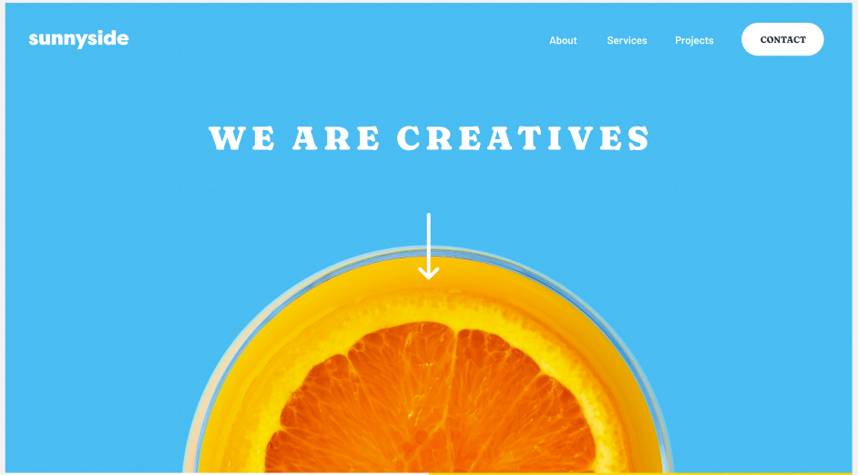

<h1 align="center">#13 Landing page</h1>


<p align="center">
  Landing page completa.
</p>

<p align="center">
  <a href="#-Funcionalidades-Principais ">Funcionalidades </a>&nbsp;&nbsp;&nbsp;|&nbsp;&nbsp;&nbsp;
  <a href="#-Tecnologias Utilizadas">Tecnologias</a>&nbsp;&nbsp;&nbsp;|&nbsp;&nbsp;&nbsp;
  <a href="#-Como-usar">instruções</a>&nbsp;&nbsp;&nbsp;|&nbsp;&nbsp;&nbsp;
</p>

<p align="center">
  
</p>

<br>

# Projeto React-Vite: Landing Page Interativa

Este projeto é uma landing page desenvolvida utilizando React e Vite, focada em apresentar serviços criativos de uma agência fictícia.

<p align="center">
  
</p>


## Funcionalidades Principais 🚀

- **Header:** Logotipo da empresa, menu de navegação, e botão destacado para contato.
- **Seção 1:** Descrição dos serviços da agência com um link "Learn More".
- **Seção 2:** Serviços de Design Gráfico e Fotografia em duas colunas.
- **Profiles:** Testemunhos de clientes com fotos e cargos.
- **Galeria de Imagens:** Exibição de trabalhos da agência.
- **Footer:** Links para navegação e redes sociais.

## Tecnologias Utilizadas 💻

- React
- Vite
- Tailwind CSS
- JavaScript
- HTML e CSS

## Como Usar 📋

1. **Instalação:**
   ```
   git clone https://github.com/seu-usuario/nome-do-repositorio.git
   cd nome-do-repositorio
   npm install
   ```

2. **Execução:**
   ```
   npm start
   ```

3. Abra seu navegador e acesse `http://localhost:3000`.

## Contribuição ✨

Contribuições são bem-vindas! Sinta-se à vontade para enviar pull requests ou abrir issues.

## Autor 🧑‍💻

Jason Araújo - [https://github.com/JasonAraujo1](https://seu-portfolio.com)

## Licença 📝

Este projeto é licenciado sob a Licença MIT - veja o arquivo [LICENSE](LICENSE) para mais detalhes.

---


```

